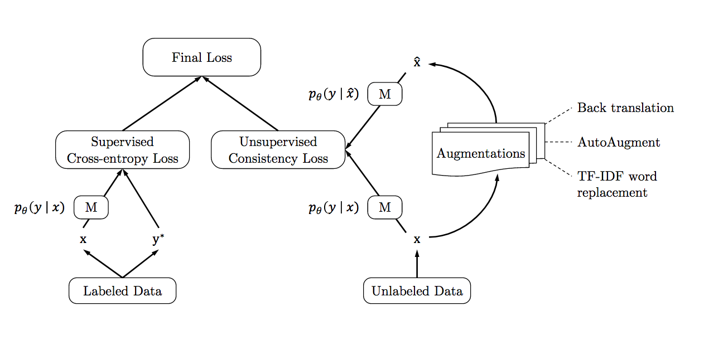

# Unsupervised Data Augmentation experiments in PyTorch

**~~~ /!\ Work in Progress /!\ ~~~**

Experiments with "Unsupervised Data Augmentation" method on Cifar10 dataset.

Based on ["Unsupervised Data Augmentation"](https://arxiv.org/pdf/1904.12848.pdf)

## Unsupervised Data Augmentation in nutshell



## Requirements

All experiments are run using [`mlflow`](https://github.com/mlflow/mlflow), please install the latest version of this library
```
pip install --upgrade mlflow
```

## Experiments

### Start MLFlow UI server

Please create output folder (e.g. `$PWD/output`) and setup mlflow server:

```
export OUTPUT_PATH=/path/to/output
```
and 
```
mlflow server --backend-store-uri $OUTPUT_PATH/mlruns --default-artifact-root $OUTPUT_PATH/mlruns -p 5566 -h 0.0.0.0
```

MLflow dashboard is available in the browser at [0.0.0.0:5566](0.0.0.0:5566)

### CIFAR10 dataset

Create once "CIFAR10" experiment
```
export MLFLOW_TRACKING_URI=$OUTPUT_PATH/mlruns
mlflow experiments create -n CIFAR10
```

Start a single run

```
export MLFLOW_TRACKING_URI=$OUTPUT_PATH/mlruns
mlflow run experiments/ --experiment-name=CIFAR10 -P dataset=CIFAR10 -P network=fastresnet -P params="data_path=../input/cifar10;lr_milestones_values=[(0, 0.0), (4, 1.0), (num_epochs, 0.0)]"
```

### Tensorboard 

All experiments are also logged to the Tensorboard. To visualize the experiments, please install `tensorboard` and run :
```
# tensorboard --logdir=$OUTPUT_PATH/mlruns/<experiment_id>
tensorboard --logdir=$OUTPUT_PATH/mlruns/1
```

### Acknowledgements

In this repository we are using code from [DeepVoltaire/AutoAugment](https://github.com/DeepVoltaire/AutoAugment) and thank the author for sharing the code!